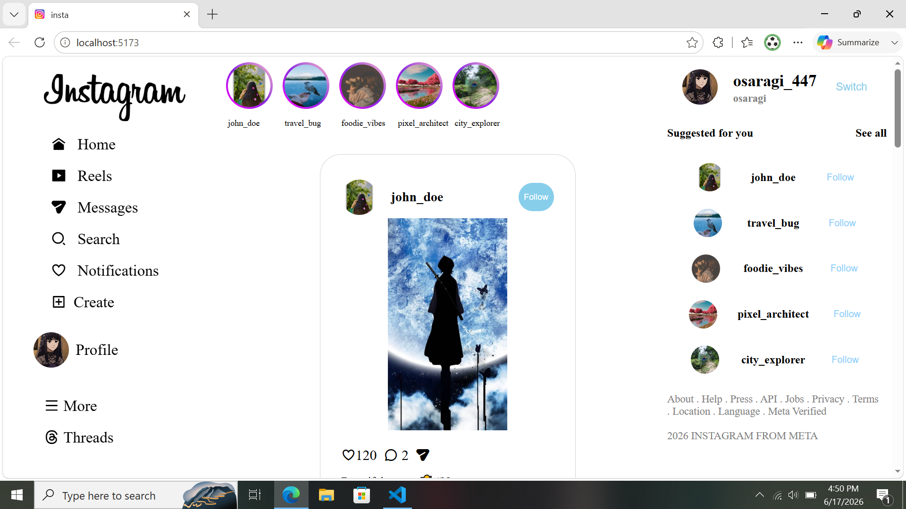
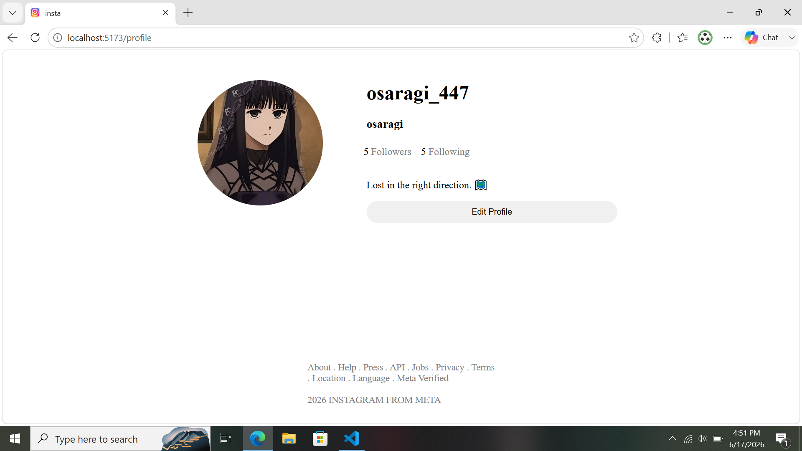
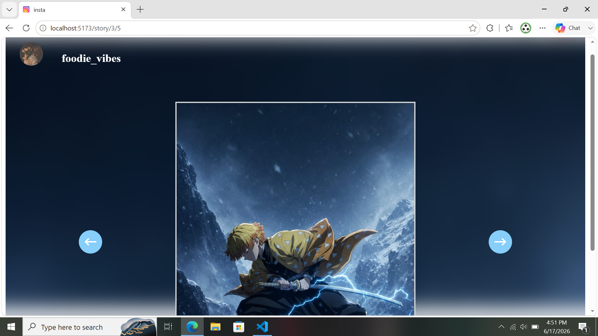
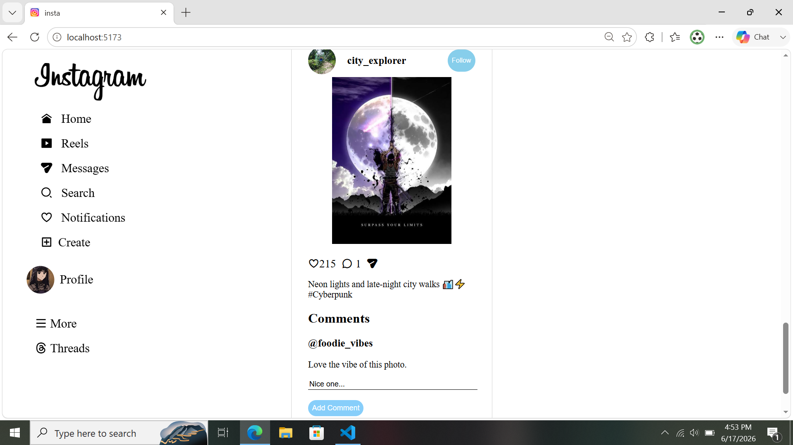

# Instagram Clone

A responsive Instagram Clone built with **React, Vite, Axios, and JSON Server**. The application reproduces core Instagram features including posts, likes, comments, stories, profile management, and follower management.

## Features

* Create and view posts
* Like and unlike posts
* Add comments
* View stories
* Edit profile
* Follow and unfollow users
* Manage followers and following
* Fetch and update data using Axios
* Mock backend using JSON Server

## Tech Stack

* React
* Vite
* Axios
* React Router DOM
* JSON Server
* CSS

## Screenshots

### Home Feed



### Profile Page



### Stories



### Comments Section



## Installation

```bash
npm install
```

## Start JSON Server

```bash
json-server --watch db.json --port 3000
```

## Run Application

```bash
npm run dev
```

## API URL

```text
http://localhost:3000
```

## Author

Ram Kumar
